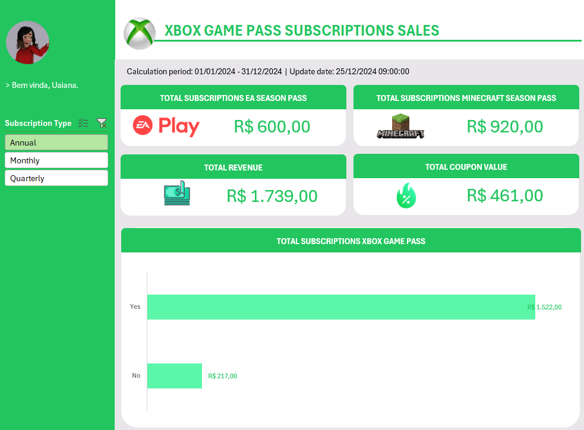

# DESAFIO DE PROJETO - BOOTCAMP RANDSTAD 2025 - DIO

O objetivo deste desafio foi criar um dashboard de vendas, com foco na organização e visualização de dados. O objetivo foi transformar dados brutos em informações visuais claras e úteis, permitindo uma análise eficaz do desempenho de vendas e a tomada de decisões baseadas em dados.

## Arquivos Contidos no Projeto

Os dados empregados no projeto, bem como o dashboard desenvolvido estão no arquivo `base-dados-dashboard.xlsx`.

## Funcionalidades do Dashboard

O dashboard possibilita a filtragem de informações por meio do campo **Subscription Type** e responde as seguintes perguntas de negócio:

1. Qual o faturamento Total contendo todas as assinaturas agregadas **Total Revenue**?
2. Qual o faturamento Total de Assinaturas do EA Play **Total Subscriptions EA Season Pass**?
3. Qual o faturamento Total de Assinaturas do Minecraft Season Pass **Total Subscription Minecraft Season Pass**?
4. Qual o Valor Total ofertado em cupons para os clientes **Total Cupon Value**?

## Layout do Dashboard

